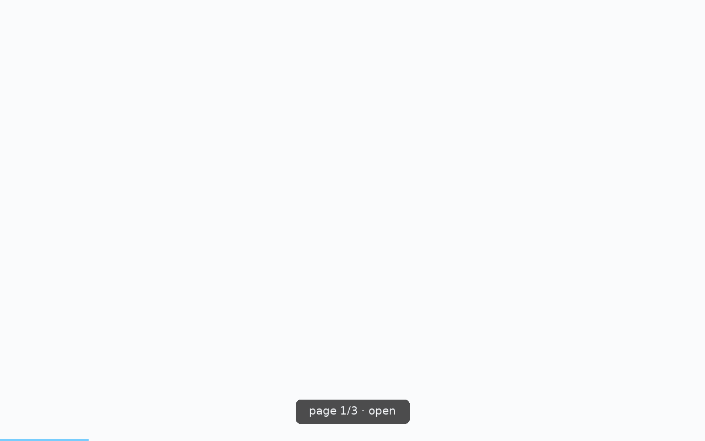

# 🎞️ clickcast

> Give AI agents visual + structured feedback about live web UIs — and give humans deterministic demo reels while you're at it.

[](https://pypi.org/project/clickcast/)
[](https://pypi.org/project/clickcast/)
[](https://github.com/AlexKay28/clickcast/actions)
[](./LICENSE)

> **What's new** — see [`CHANGELOG.md`](CHANGELOG.md) for the latest release notes.



> **Not to be confused with [vercel-labs/webreel](https://github.com/vercel-labs/webreel)** — that's a TypeScript tool for authoring polished demo videos. `clickcast` is a Python tool aimed primarily at *AI agents* that need a visual modality onto a live web UI, and secondarily at humans who want reproducible demo reels.

`clickcast` drives a real browser through a website and hands back **two things**:

1. A watchable **reel** — GIF / MP4 / WebP / raw frames.
2. A machine-readable **JSON sidecar** — every step's selector, timings, per-step frame paths, discovered elements, and post-action page state (title, URL, console errors, failed requests). Versioned. See [`docs/feedback-schema.md`](docs/feedback-schema.md).

Point it at a URL and it will *auto-discover* the interactive elements and build a tour for you, or hand it a small YAML **scenario** for a scripted, repeatable walkthrough.

---

## Install

```bash
pip install clickcast                 # requires Python ≥ 3.10
clickcast install                     # download chromium (~one-time, ~180 MB)
clickcast doctor                      # verify environment
```

On Linux CI you'll need the system libs Chromium depends on:

```bash
clickcast install --with-deps chromium
```

---

## First run — 30 seconds

```bash
clickcast auto https://example.com --out tour.gif
```

Produces two files:

- `tour.gif` — the reel
- `tour.gif.json` — the AI-consumable sidecar (`schema_version: 1`, spec at [`docs/feedback-schema.md`](docs/feedback-schema.md))

For a walkthrough of how an LLM agent consumes both, see [`docs/ai-integration.md`](docs/ai-integration.md).

---

## Three modes

| Mode | Command | When |
|---|---|---|
| **Auto** | `clickcast auto <url>` | Quick tour of a site; you don't care about the exact script. |
| **Scenario** | `clickcast run tour.yml` | Precise, repeatable walkthrough. Docs, release notes, CI. |
| **Shot** | `clickcast shot <url>` | One screenshot, viewport or full-page. |

All three are deterministic, headless-by-default, and CI-friendly.

---

## Commands

### `auto <url>`

Discover interactive elements and record a click-tour.

| Flag | Default | Notes |
|---|---|---|
| `--out PATH` | `reel.gif` | Extension picks the format. |
| `--max-steps N` / `-N` | `10` | Cap on discovered elements to click. |
| `--dwell SEC` | `1.0` | Hold time after each action. |
| `--initial-wait SEC` | `2.0` | Post-`networkidle` hold to let SPAs hydrate. |
| `--viewport WxH` | `1280x800` | |
| `--device NAME` | – | Playwright preset (e.g. `"iPhone 15"`, `"Pixel 8"`). |
| `--engine E` | `chromium` | `chromium` / `firefox` / `webkit`. |
| `--headful` | off | Show a real browser window. |
| `--lang LOCALE` | – | e.g. `en-US`. |
| `--dark` | off | Emulate `prefers-color-scheme: dark`. |
| `--fps N` | `12` | |
| `--format F` | – | Override extension-derived format. |
| `--quality 1..30` | `8` | Lower = better (higher fidelity, bigger file). |
| `--loop N` | `0` | `0` = infinite. |
| `--no-sidecar` | off | Skip the JSON. |
| `-v` / `--verbose` | – | Repeatable. |

### `run <scenario.yml>`

Execute a YAML scenario. See [Scenario format](#scenario-format).

```bash
clickcast run docs/scenarios/spa.yml \
    --out release-notes.mp4 --format mp4 \
    --var base_url=https://staging.example.com
```

Flags: `--out`, `--format`, `--headful`, `--slowmo MS`, `--var key=value` (repeatable — substitute `{{ key }}` inside the scenario), `--no-sidecar`.

CLI flags override the scenario's `meta:` block.

### `shot <url>`

Single screenshot.

```bash
clickcast shot https://example.com --full-page --out home.png
```

Flags: `--out`, `--full-page`, `--wait` (`load` / `domcontentloaded` / `networkidle` / a selector / a number of seconds), `--viewport`, `--device`, `--engine`, `--dark`.

### `init [path]`

Scaffold a starter YAML scenario. `--from-auto` runs discovery once and seeds the file with the top-scoring click steps.

```bash
clickcast init tour.yml --url https://example.com --from-auto
```

Flags: `--url`, `--name`, `--out`, `--from-auto`, `--force`.

### `elements <url>`

Dump the discovered interactive elements — useful for authoring selectors.

```bash
clickcast elements https://example.com --json > elements.json
```

Flags: `--limit`, `--json`, `--viewport`, `--engine`.

### `doctor`

Check Python version, playwright, engine binaries, ffmpeg, config path.

```bash
clickcast doctor           # human-readable
clickcast doctor --json    # machine-readable, non-zero exit on failure
```

### `config`

Read / write persistent defaults.

```bash
clickcast config path                    # print the user config file path
clickcast config list                    # every effective value + source
clickcast config get engine
clickcast config set engine firefox
```

Set values land in the user TOML at `clickcast config path`. See [Configuration](#configuration) for precedence.

### `install [engines…]`

Wrapper over `playwright install`. Default engine: `chromium`.

```bash
clickcast install                        # chromium only
clickcast install firefox webkit         # add more
clickcast install --with-deps chromium   # Linux: pull system libs (needs sudo)
```

---

## Scenario format

A scenario is plain YAML: a `meta:` block and a list of `steps:`. Full worked examples: [`docs/scenarios/`](docs/scenarios/).

```yaml
meta:
  name: WorldSight broad tour
  engine: chromium              # chromium | firefox | webkit
  viewport: 1280x800
  device: null                  # or "iPhone 15", "Pixel 8", "iPad Pro"
  fps: 12
  dwell: 1.0                    # default seconds after each step
  format: gif                   # gif | mp4 | webp | frames
  out: worldsight.gif

steps:
  - goto: https://worldsight-weld.vercel.app
    wait: networkidle
    label: Open WorldSight

  - click: "text=3D"
    label: Switch to 3D globe
    dwell: 2.0

  - hover: "[aria-label='Rankings']"
  - click: "[aria-label='Rankings']"
    label: Open Rankings

  - type:
      into: "#search"
      text: "Japan"
    label: Search Japan

  - select:
      in: "#metric"
      value: "GDP"

  - scroll:
      to: footer
```

### Supported actions

| Action | Example | Notes |
|---|---|---|
| `goto` | `goto: https://…` | Navigate. Pair with `wait`. |
| `click` | `click: "text=Compare"` | CSS, `text=…`, or `role=…` selectors — Playwright syntax. |
| `dblclick` | `dblclick: ".cell"` | |
| `hover` | `hover: ".menu"` | Reveals CSS `:hover` state. |
| `type` | `type: { into: "#q", text: "Japan", delay: 40 }` | `delay` is per-char ms. |
| `press` | `press: "Enter"` | Or `press: { key: "Ctrl+A", selector: "#in" }`. |
| `select` | `select: { in: "#m", value: "GDP" }` | `in:` in YAML → `into` internally. |
| `scroll` | `scroll: { to: "footer" }` or `scroll: { by: 600 }` | Element or pixel scroll. |
| `wait` | `wait: 1.5` or `wait: networkidle` or `wait: ".map-loaded"` | Number = seconds, string = load-state or selector. |
| `screenshot` | `screenshot: { full_page: true }` | Force a frame capture. |

Every step also accepts `label`, `dwell`, `optional: true` (don't fail the run if the selector is missing — sidecar records `status: "skipped"`), and `repeat: N`.

Variable substitution: `{{ key }}` inside any string, injected via `--var key=value`.

---

## Python API

Fluent, chainable — every builder returns `self`:

```python
from clickcast import Reel

reel_path = (
    Reel("https://worldsight-weld.vercel.app", viewport=(1280, 800), fps=12)
    .goto(wait="networkidle")
    .click("text=3D", label="Switch to 3D globe", dwell=2.0)
    .click("[aria-label='Rankings']", label="Open Rankings")
    .scroll(to="footer")
    .save("worldsight.gif")  # or .save("tour.mp4", quality=8)
)
```

Async variant for callers already inside a running event loop:

```python
from clickcast import AsyncReel

reel = AsyncReel("https://example.com").goto(wait="networkidle").click("#cta")
path = await reel.save("tour.gif")
```

Discovery only, no reel:

```python
from clickcast import discover

elements = discover("https://example.com", limit=10)
```

Skip the sidecar with `save(..., no_sidecar=True)`.

---

## Reading the sidecar

Every recording run writes `<out>.json` alongside the media file.

```python
from clickcast.feedback import load

report = load("tour.gif.json")

for step in report.steps:
    if step.status == "failed":
        print(f"step {step.index} ({step.action}) failed: {step.error}")
        print("  frames:", step.frames)
        if step.page_state:
            print("  console errors:", step.page_state.console_errors)
```

Consumers that don't want to import `clickcast` can parse the JSON directly against the schema at [`src/clickcast/feedback/schema/v1.json`](src/clickcast/feedback/schema/v1.json). A standalone reference implementation lives at [`tests/consumer/read_sidecar.py`](tests/consumer/read_sidecar.py).

See [`docs/ai-integration.md`](docs/ai-integration.md) for the two-line agent-integration example and [`docs/feedback-schema.md`](docs/feedback-schema.md) for the full field-by-field walkthrough.

---

## Configuration

Precedence (highest → lowest):

1. CLI flags
2. Scenario `meta:` block
3. `CLICKCAST_*` environment variables
4. Project `./clickcast.toml`
5. User TOML (path via `clickcast config path`)
6. Built-in defaults

Every `Config` field can be set at any of these layers: `engine`, `viewport`, `device`, `headful`, `slowmo`, `lang`, `dark`, `proxy`, `fps`, `dwell`, `format`, `quality`, `loop`.

Project TOML — flat or `[defaults]`-wrapped both work:

```toml
# clickcast.toml
engine   = "chromium"
viewport = "1280x800"
fps      = 12
dwell    = 1.0
format   = "gif"
```

Env vars:

```bash
CLICKCAST_ENGINE=firefox
CLICKCAST_VIEWPORT=1440x900
CLICKCAST_HEADFUL=true
CLICKCAST_PROXY=http://proxy.internal:8080
```

---

## Output formats

| Format | Best for | Notes |
|---|---|---|
| `gif` | READMEs, chat, quick shares | Widest compatibility; larger files. |
| `mp4` | Docs sites, social, long tours | Smallest for length; uses `imageio-ffmpeg`'s bundled binary. |
| `webp` | Web embedding | Great size/quality; animated. |
| `frames` | Custom pipelines | Numbered PNGs + a `frames.json` manifest. |

`--quality 1..30` trades size for fidelity (lower = better). `--loop 0` loops forever; `--loop 1` plays once.

---

## How it works

```
   URL ─▶ Session ─▶ Actions ─▶ Recorder ─▶ Encoder ─▶ .gif/.mp4/.webp
        (chromium)  (auto or   (per-step   (Pillow /
                     YAML)      PNGs +      imageio-
                                manifest)   ffmpeg)
                        │           │
                        ▼           ▼
              PageStateCollector    ─▶ ReportBuilder ─▶ <out>.json
                (console errors,
                 page errors,
                 failed requests)
```

1. **Session** launches a Playwright browser at the requested viewport/device.
2. **Actions** run one step at a time (`click`, `type`, `scroll`, …) with normalised timings and cursor tracking.
3. **Recorder** captures a pre-frame + N padding frames per step (deterministic filenames, byte-identical copies for padding).
4. **PageStateCollector** subscribes to page events for the sidecar.
5. **Encoder** produces the final artifact; **ReportBuilder** finalises the JSON.

The annotator (`clickcast.annotate.Annotator` — click ripples, cursor trail, caption bar, progress bar) ships as a library API in v0.1. Automatic wiring into `auto` / `run` outputs is planned for v0.2 (see [Roadmap](#roadmap)).

---

## Troubleshooting

- **Blank frames** — the site is a SPA; increase `--initial-wait`, or add `wait: networkidle` (or a specific selector) to the first step.
- **`ffmpeg not found`** — `imageio-ffmpeg` bundles a static binary; falls back if missing. Choose `gif` / `webp` if you'd rather skip MP4 entirely.
- **Selector not found** — `clickcast elements <url>` shows what's actually clickable. Or mark the step `optional: true`.
- **Can't reach an internal site** — set `CLICKCAST_PROXY`, or `proxy` in the scenario `meta:` block.
- **Chromium missing** — `clickcast install`. On Linux CI add `--with-deps`.
- **Sidecar shape changed** — the current schema is versioned at `src/clickcast/feedback/schema/v1.json`; a future v2 (see [#29](https://github.com/AlexKay28/clickcast/issues/29)) will add a `graph` block without breaking v1 consumers.

---

## Contributing

```bash
git clone https://github.com/AlexKay28/clickcast
cd clickcast
pip install -e ".[dev]"
clickcast install
```

Before opening a PR:

```bash
ruff check .
ruff format --check .
mypy
pytest -m "not integration"      # fast; ~2s
pytest                            # full; needs chromium
```

Cutting a release is documented in [`RELEASING.md`](RELEASING.md).

---

## Roadmap

**v0.1** (this release): Session · Actions · Recorder · Encoder · Discovery · YAML scenarios · CLI · Python API · Sidecar (schema v1) · Config precedence · Fixture test site · Docs.

**v0.2** (planned — tracked in [#29](https://github.com/AlexKay28/clickcast/issues/29)):

- On-frame HUD — fixed header/footer with step index, action verb, target role, URL. OCR-legible so LLMs can *read* the reel as a strip of images.
- BFS UI exploration — `clickcast explore <url>` treats the app as a state graph: discover → click → discover the new state → recurse. Bounded, deterministic, with visited-state dedup.
- Sidecar schema v2 — adds a top-level `graph` block (nodes = distinct page states, edges = `(from, to, action, transition_kind)`).
- Automatic annotation of `auto` / `run` outputs.

---

## License

MIT © 2026 Alex Kay. See [LICENSE](./LICENSE).
